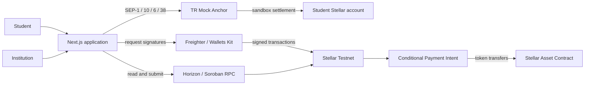
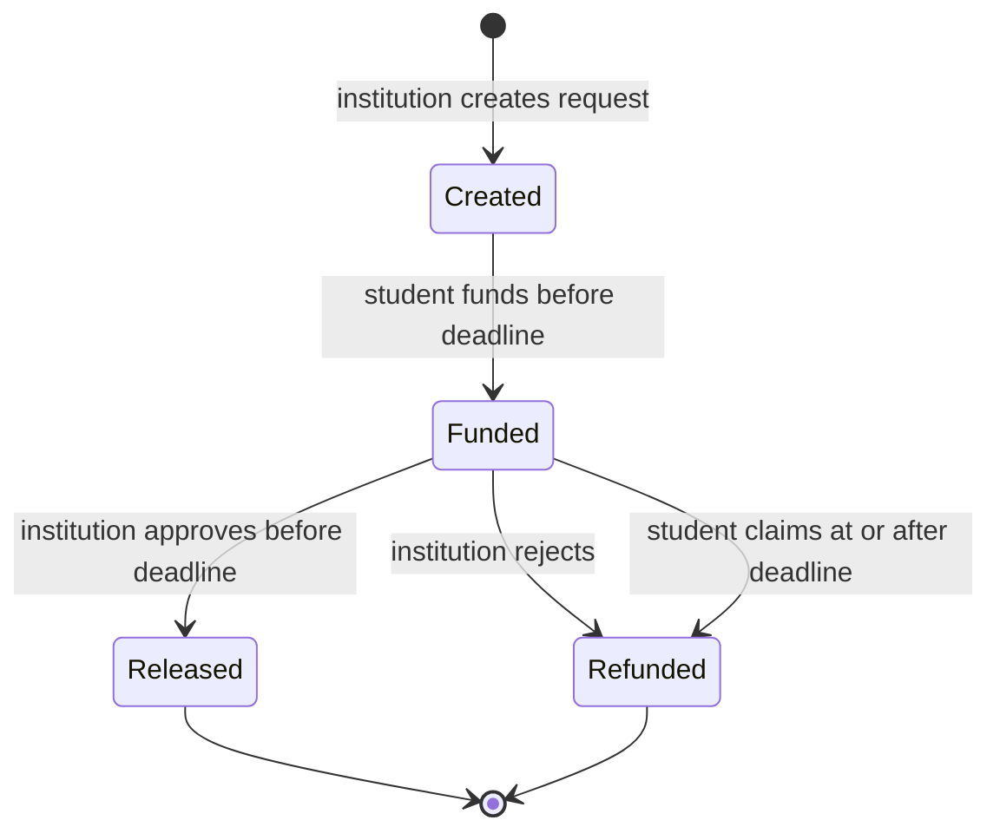

# ArrivalPay

**Turn one required enrollment payment into a reusable Stellar wallet.**

## 30-second overview

ArrivalPay is a Stellar Testnet application for international student enrollment deposits. An institution creates a payment request with an amount, student wallet and decision deadline. The student funds it; a Soroban contract holds the tokens until the institution approves or rejects the request, or the student claims a refund after the deadline.

**Release status:** deployment preparation in progress. The wallet, Anchor sandbox integration and contract frontend exist. The last recorded live Anchor deposit remained pending; a complete TRY → canonical USDC → escrow journey has not yet been demonstrated. See [verification and release status](docs/QA.md) for the final checks and [demo instructions](docs/DEMO.md) for a reproducible walkthrough.

## The problem

Some international students must pay a tuition deposit before completing enrollment or obtaining visa documentation. The payment, the institution's decision and the refund process can happen in separate systems. ArrivalPay brings the amount, deadline, authorized decision-maker and settlement status into one shared payment record. It does not decide admission or verify visa outcomes.

## Why this market matters

The University of Sheffield describes fee deposits required before issuing a CAS for applicable applicants, demonstrating a concrete upfront-payment use case; requirements vary by institution and course. [University guidance](https://www.sheffield.ac.uk/fees/fee-deposits).

Flywire reported over **$37.6 billion** in total payment volume across its business in 2025. That demonstrates an established payments market and substantial competition; it is neither enrollment-deposit volume nor ArrivalPay's addressable market. [Flywire 2025 Form 10-K](https://www.sec.gov/Archives/edgar/data/1580560/000119312526067540/flyw-20251231.htm).

The initial target is a small pilot with participating institutions and students funding from Turkey. No customer interviews, institutional agreements, active users or revenue are claimed.

## Market estimate — assumptions, not facts

An illustrative scenario from the product brief is:

```text
Assumed new internationally mobile students annually: 1.4M–2.0M
Assumed share paying an upfront deposit:              20%–40%
Assumed deposit size:                                $2,000–$5,000
Modeled annual flow: students × share × deposit       $0.56B–$4.0B
```

These inputs have not been validated. This is a payment-flow scenario, not measured market size, obtainable volume or projected revenue. A pilot must first establish institutions' willingness to adopt conditional settlement and students' ability to complete wallet onboarding.

## Existing solutions and differentiation

Education payment providers already address international collections, currency conversion and reconciliation. ArrivalPay explores a narrower approach: **institution-authored conditions, publicly inspectable on-chain settlement and a wallet the student retains**. The project does not claim that incumbents lack refund services, or that a blockchain replaces their banking and compliance infrastructure.

## The product

1. **Create:** the institution signs a request naming the student, token amount and deadline.
2. **Prepare funds:** the student connects Freighter, enables canonical Testnet USDC and requests TRY funding through TR Mock Anchor. The bank-transfer step is explicitly simulated.
3. **Fund:** after sufficient USDC is actually available, the student separately signs a transfer into the intent contract.
4. **Resolve:** institution approval releases funds; institution rejection refunds them. At the deadline, approval closes and the student can sign a timeout-refund claim. Refunds return tokens to the wallet, not TRY to a bank account.

| Screen | Purpose |
|---|---|
| `/` | Product explanation and illustrated payment journey |
| `/student` | Wallet, USDC access, sandbox funding and assigned requests |
| `/institution` | Create requests and make authorized release/refund decisions |
| `/intent/[id]` | Read a request's contract state and available actions |
| `/transactions` | Source-labeled Anchor history and latest Stellar account transactions |
| `/arrival-services` | QR/link payment requests and direct Testnet USDC payments |

## Why Stellar

- **Anchors and SEPs:** discovery (SEP-1), signed authentication (SEP-10), deposit instructions/status (SEP-6) and quotes (SEP-38) connect local funding to Stellar. The integration is pinned to the known TR Mock Anchor; another provider requires validation and potentially adapter changes.
- **USDC and trustlines:** students hold the asset in their own Stellar account. The application checks both asset code and issuer, rather than trusting a token called USDC.
- **Soroban:** the contract verifies the authorized wallet, state and ledger deadline before moving tokens. A failed transfer and its state update revert atomically.
- **Reusable accounts:** the same account can support later payments without opening a separate ArrivalPay custodial balance.

## How ArrivalPay could benefit the Stellar network

A participating institution could introduce students to Stellar through a payment they already need to make. Successful onboarding could lead to new funded accounts, Anchor deposits, USDC transfers and contract interactions, followed by additional uses of the same wallet. These are intended adoption mechanisms; no measured network growth is claimed.

## Architecture



The frontend uses Next.js App Router, TypeScript, React and centralized CSS/Tailwind tokens. Network services are separated from client-side flow controllers. The contract uses Rust and Soroban SDK. No ArrivalPay database or server-side signing service is required. [Detailed architecture](docs/ARCHITECTURE.md).

## Contract state machine



`fund` and `approve` require ledger time **< deadline**; timeout refund requires **>= deadline**. Rejection remains possible after the deadline. A timeout creates the right to claim; it does not automatically send a transaction. The deployed contract accepts a token specified at creation; the ArrivalPay interface uses canonical Testnet USDC. Contract test assets must not be represented as canonical USDC. [Contract API and deployment evidence](docs/CONTRACT.md).

## Anchor integration

Discovery verifies the Testnet passphrase, signing key, endpoints and USDC issuer before authentication. SEP-10 challenges are checked before Freighter signs them. JWTs remain in browser memory. SEP-38 returns a time-limited quote; SEP-6 returns a sandbox IBAN/reference and deposit status. No real bank transfer happens.

The application discovers the SEP-12 endpoint but does not implement a real KYC flow. Anchor acceptance of a simulated transfer is distinct from USDC settlement. The earlier live evidence records `pending_anchor`, not `completed`. [Anchor QA](docs/PHASE_3_4_QA.md).

## Repository structure

```text
src/app/                  Next.js routes and global styles
src/components/           Shared layout, controls and feedback
src/config/               Testnet endpoints and asset identity
src/features/wallet/      Freighter connection and trustline flow
src/features/anchor/      Authentication and TRY funding state
src/features/intents/     Request discovery, roles and actions
src/features/institution/ Institution request creation
src/features/arrival-services/ QR/link requests and direct payments
src/features/transactions/ Source-labeled payment activity
src/services/             Stellar, Anchor and Soroban network clients
contracts/conditional-payment-intent/  Rust contract and tests
tests/e2e/                Browser tests with explicit fixtures
tests/live/               Opt-in real Testnet integration tests
docs/evidence/            Public addresses, IDs and transaction hashes
```

## Getting started

Requires **Node.js 24** and npm. Freighter is needed for browser signatures. For contract work, install Rust, the `wasm32v1-none` target and Stellar CLI.

```sh
npm ci
npm run dev
# Open http://127.0.0.1:3000
```

Defaults point to Testnet and the deployed contract. No secret or environment file is required to start. If overriding public settings, copy `.env.example` to `.env.local`.

```sh
cargo test -p conditional-payment-intent
stellar contract build
```

A frontend deployment does not redeploy the contract. See [deployment and recovery](docs/DEPLOYMENT.md) for Vercel, Testnet reset and contract setup.

## Environment variables

| Variable | Default / constraint |
|---|---|
| `NEXT_PUBLIC_STELLAR_NETWORK` | `testnet`; other networks rejected |
| `NEXT_PUBLIC_ANCHOR_URL` | `https://tr-mock-anchor.fly.dev` |
| `NEXT_PUBLIC_HORIZON_URL` | `https://horizon-testnet.stellar.org` |
| `NEXT_PUBLIC_STELLAR_RPC_URL` | `https://soroban-testnet.stellar.org` |
| `NEXT_PUBLIC_INTENT_CONTRACT_ID` | Deployed contract below |

Empty values select defaults. Endpoint overrides are restricted to the known Testnet services. `NEXT_PUBLIC_*` values are exposed to the browser: never put a secret key, seed phrase, JWT or deployment token there.

## Testing

```sh
npm run lint
npm run typecheck
npm test
npm run build
npx playwright install chromium
npm run test:e2e
cargo test -p conditional-payment-intent
# Optional: creates temporary accounts and transactions on Testnet
npm run test:live
```

The Phase 6 recorded baseline was **82 JavaScript tests, 48 browser tests and 16 contract tests**. New release results belong in [QA](docs/QA.md), not in an assumed pass count. Browser fixtures prove UI behavior; Node live fixtures prove service/network interaction. Neither establishes that the user's real Freighter extension completed the journey.

## Live demo and Testnet evidence

**Live frontend:** https://arrivalpay.vercel.app — deployed from this repository's `main` branch; a post-deploy smoke check confirmed `/`, `/student`, `/institution` and `/arrival-services` all return HTTP 200.

**Intent contract:** `CDL4LVIFDJGLZCYJ7W2644NSYKPGMC6K5XPEPYHRTXPWZ2LNWBCD7NNK` — [Stellar Lab](https://lab.stellar.org/r/testnet/contract/CDL4LVIFDJGLZCYJ7W2644NSYKPGMC6K5XPEPYHRTXPWZ2LNWBCD7NNK).

**Canonical Testnet USDC issuer:** `GBBD47IF6LWK7P7MDEVSCWR7DPUWV3NY3DTQEVFL4NAT4AQH3ZLLFLA5`.

| Evidence | What it demonstrates |
|---|---|
| [Trustline](docs/evidence/phase-2-testnet.json) | Canonical USDC access on a temporary Testnet account |
| [Anchor deposit](docs/evidence/phase-3-4-anchor.json) | Real sandbox auth, quote and transfer simulation; settlement remained pending |
| [Contract flows](docs/evidence/phase-5-contract.json) | On-chain approval/rejection and an atomic transfer failure |
| [Application service flow](docs/evidence/phase-6-intent.json) | Create → fund → approve using this application's services and a **fixture token** |

A Phase 6 [approval transaction](https://stellar.expert/explorer/testnet/tx/af4df6512668d3045b8b697c31a88c1b4cb816df70fa2cc8aa7c92c431863956) is independently inspectable. Testnet resets may remove historical records.

## Demo script

Use two Testnet wallets: institution and student. Both need XLM for fees; the student needs enough canonical USDC and the institution needs a USDC trustline to receive a release.

1. Show the request terms on `/institution`; create a small request assigned to the student.
2. Switch to the student. Explain wallet ownership, trustline and sandbox TRY funding. Show pending status honestly if the Anchor has not settled.
3. Once USDC is available, fund the request. Inspect the confirmed transaction and `Funded` state.
4. Switch to the institution, approve or reject, then show the resulting state and transaction. Use a separate request to demonstrate the alternative outcome.

Allow 2–3 minutes for the prepared explanation; live signatures and external settlement can take longer. [Detailed demo and recovery guide](docs/DEMO.md), [Turkish presentation notes](docs/PRESENTATION_NOTES.md).

## Security and privacy

The app never requests secret keys. Wallet signing is separate from submission, and signed transaction contents are verified. SEP-10 sessions are held in memory. Public keys, intent terms, amounts and on-chain decisions are public; do not put passport, visa or student identity documents on-chain. UI role checks aid navigation; contract authorization is the security boundary. [Security and limitations](docs/SECURITY_AND_LIMITATIONS.md).

## Limitations and trust assumptions

- This is a publicly deployable **Testnet demo**, not a live-money payment service or an audited production contract.
- Institutions must participate and are responsible for admission decisions. A connected public key is not proof of an accredited institution.
- Mock fiat transfer, institution decision and on-chain settlement are separate trust boundaries. No guaranteed admission, visa verification or bank refund is provided.
- The contract stores per-address ID vectors; read pagination does not make the storage index indefinitely scalable. An indexer/storage redesign and archive restoration operations are required before large-scale use.
- Contract TTL extensions made during RPC simulation are not committed to the ledger. Long-lived escrow needs explicit maintenance and tested restoration.
- Freighter extension accounts are the supported browser path. Mobile wallet handoff, multisig and hardware-wallet flows are not implemented.
- Canonical Anchor-funded end-to-end settlement and real Freighter acceptance remain separate release checks. See QA for actual outcomes.

## Roadmap

First validate the flow with students and participating institutions in one corridor. Then evaluate institution identity verification, a licensed Anchor, contract audit and operations, onboarding improvements and sustainable pricing. Arrival Services QR payments are included as a limited direct-USDC extension. TRY withdrawals, housing deposits, additional payment-intent types and SDK integrations remain roadmap items. [QR proposal](docs/ARRIVAL_SERVICES_QR_PROPOSAL.md).

## Hackathon requirement mapping

| Area | Implementation / evidence |
|---|---|
| Stellar integration | Freighter, Horizon, canonical asset identity, Soroban RPC |
| Local funding | SEP-1/10/6/38 against TR Mock Anchor; simulated bank leg clearly labeled |
| Smart contract | Authorization, escrow, deadline and one-time settlement; Rust tests |
| Usable product | Student, institution and request screens; responsive browser tests |
| Reproducibility | Pinned dependencies, setup commands, evidence and demo guide |
| Delivery | Public URL recorded after deploy; submission/team/pitch materials are owner-managed |

This mapping is evidence for review, not a claim of finalist selection or organizer acceptance of mock fiat rails.

## Acknowledgements / skills used

[Stellar dApp skill](https://skills.stellar.org/skills/dapp/SKILL.md), [Stellar assets skill](https://skills.stellar.org/skills/assets/SKILL.md), [Stellar Wallets Kit](https://stellarwalletskit.dev), [Stellar developer documentation](https://developers.stellar.org), [TR Mock Anchor reference](https://tr-mock-anchor.fly.dev/llms-full.txt), and the supplied [design brief](DESIGN.md) informed implementation. Refero's design workflow and bundled craft references informed interface work; live Refero research was unavailable because the subscription was inactive. [All project resources](RESOURCES.md).

## License

No open-source license has been selected by the owner. Source availability does not itself grant a license; third-party packages retain their respective licenses.
